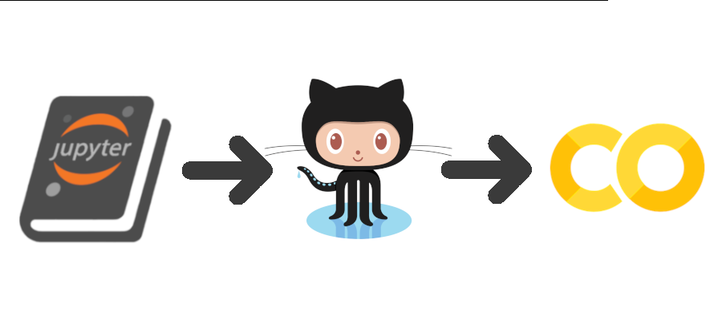

# Jupyter Book on O.P.P.

J-bopp is a no-money technique to get Jupyter Books published and running on other people's:
- Processors
- Publishing systems
- Persistance
- Platforms, but no thanks on the Kool-Aid

Specifically, the other "people" are Google and Microsoft:
- Processors: GOOG's Colab
- Publishing system: MSFT's GitHub Actions to build a Jupyter Book
- Persistance: MSFT's GitHub for storage for the source repo and the SSG public web site via GitHub Pages
  
The project is called "J-bopp," with that spelling, capitalization,
and punctuation in homage to
[K-pop](https://en.wikipedia.org/wiki/K-pop) and
[J-pop](https://en.wikipedia.org/wiki/J-pop), which I know almost
nothing of but I liked how the "JB on O.P.P." tagline and acronym were
working out. The repo is called "j-bopp" because only a barbarian
would use capital letters.

